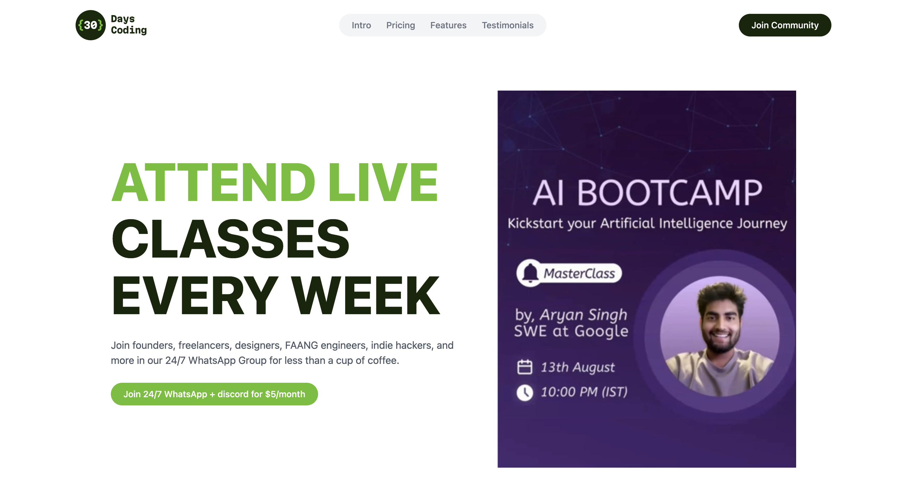
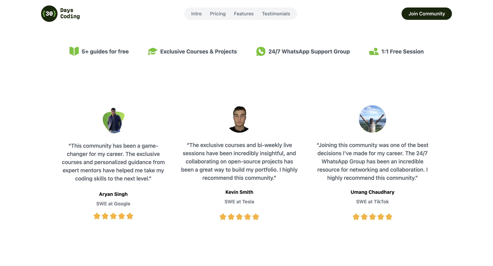
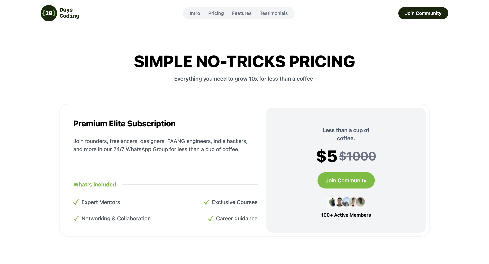
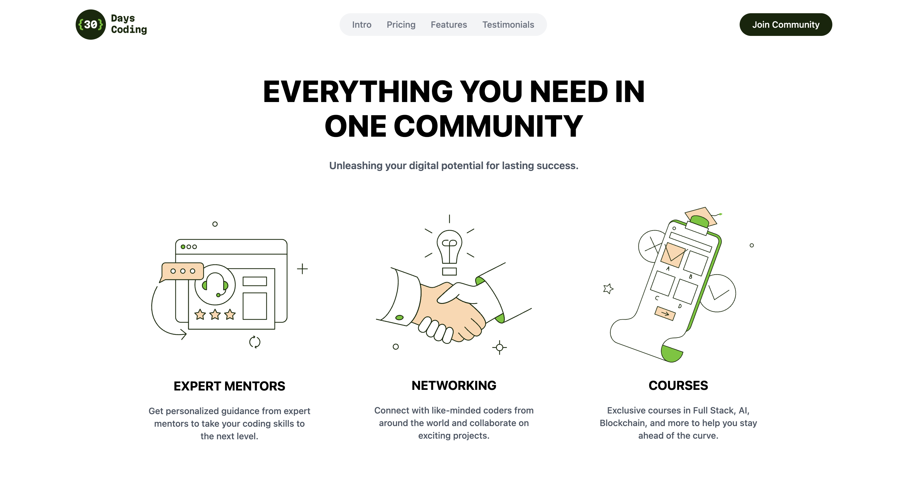

# EdTech

## Overview

The landing page is a visually engaging and responsive web page designed to showcase a course offering. Built with React and styled using Tailwind CSS, this project aims to provide a seamless user experience for potential students interested in joining a tech course or community. The landing page includes interactive features, a modern design, and a responsive layout, making it accessible on both mobile and desktop devices.

## Features

- **Responsive Design**: Adapts to various screen sizes and devices.
- **Interactive Navigation**: Includes a dropdown menu for mobile devices.
- **Promotional Sections**: Highlights course benefits, testimonials, and pricing.
- **Visual Appeal**: Utilizes modern design principles with Tailwind CSS and React.

## Screenshots

### Homepage

### Testimonials

### Pricing Section

### Community Section

## Live Demo

Check out the live version of the project here: [Live Demo](https://edtechfe.netlify.app)

## Technologies Used
- **React**: For building the user interface.
- **Tailwind CSS**: For styling the components.
- **React Icons**: For including icons in the UI.

## Usage

### Customization
- To Change Content: Edit the components in the src/components directory.
- To Modify Styles: Update App.css or the Tailwind CSS configuration.

### Troubleshooting
- Build Issues: Ensure all dependencies are installed. Run npm install and resolve any error messages.
- Deployment Issues: Check the configuration settings of your hosting platform.
